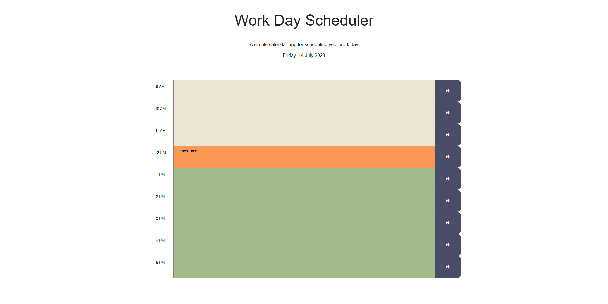

# w5-work-day-scheduler

## Description

This is a simple application where you can schedule events on an hourly interval.

## Installation

N/A

## Usage

Access the webpage using the deployed link [HERE](https://trahy.github.io/w5-work-day-scheduler/).

- Upon opening the webpage, the current day and date is displayed at the top.

- Below is a scheduler for standard business hours (from 9am to 5pm).

- The following legends indicate when a time block is in the past, present or future.

    -  Past
    -  Present
    -  Future
  

- Enter an event into any time block

- Click the save button on the right-hand side to keep the events even when the page is refreshed

## Screenshot

## Credits

Special thanks to Xandromus for providing the starter code for this application.

https://github.com/coding-boot-camp/crispy-octo-meme

## License

Please refer to the LICENSE in the repo.

---